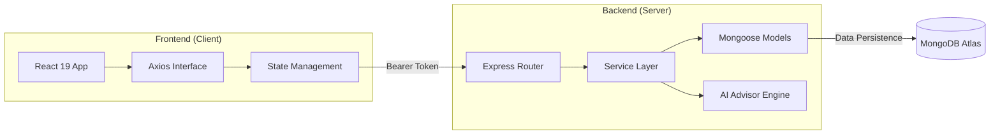
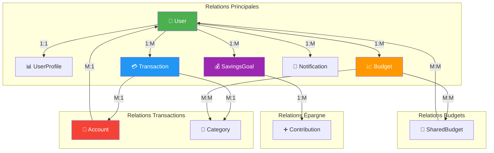

# 🚀 SmartWallet AI - The Future of Personal Finance

SmartWallet AI is a comprehensive, high-end financial management ecosystem built on the **MERN stack** (MongoDB, Express, React, Node.js). It is designed to bridge the gap between traditional expense tracking and intelligent financial planning, offering a seamless, glassmorphic experience across all devices.

---

## 🌟 Our Mission
To empower individuals with real-time financial clarity and AI-driven insights, making wealth management intuitive, secure, and visually inspiring.

---

## 📺 Démonstration


> [!TIP]
> Vous pouvez visionner la vidéo complète de démonstration ici : [Regarder resultat.mp4](./resultat.mp4)

---

## 🏗 System Architecture & Flow

SmartWallet AI is built using a decoupled **Client-Server architecture**, ensuring high performance, security, and scalability.



---

## �️ Database Schema & Entity Relationships

The following diagram illustrates the core entities within the SmartWallet AI ecosystem and how they relate to one another.



---

## �🔥 Key Features & Module Details

### 1. 📂 Core Entities & Management
- **🏦 Unified Accounts**: Manage multiple account types (Checking, Savings, Investments, Crypto) with real-time balance tracking.
- **💸 Intelligent Transactions**: record income and expenses with precise categorization and automatic account synchronization.
- **📁 Custom Taxonomy**: Create a personalized financial structure using custom categories with distinctive icons and colors.

### 2. 📊 Planning & Budgeting
- **🎯 Dynamic Budgets**: Set strict or flexible limits per category. The system automatically calculates your "Remaining Balance" based on real-time spending.
- **🚀 Savings Milestones**: Set long-term goals (e.g., "New Home", "Emergency Fund") and visualize your progress with interactive progress bars.

### 3. 🔔 Intelligence & Feedback
- **🤖 AI Advisor (Full)**: Integrated Gemini AI providing personalized spending reports, market trends, and financial strategies.
- **💬 Interactive Chatbot**: 24/7 floating assistant for immediate financial questions and data analysis.
- **⚡ Proactive Notifications**: Instant alerts for budget thresholds, goal achievements, and system updates.

---

## 🛠 Advanced Technology Stack

### **Frontend Implementation**
- **React 19**: Utilizing the latest features for optimized rendering and hook-based logic.
- **Vite**: Modern build tool for ultra-fast HMR and development.
- **Glassmorphism UI**: High-end aesthetic using CSS back-drop filters, vibrant gradients, and micro-animations.
- **SweetAlert2**: Professional, non-intrusive UI feedback and confirmation dialogs.

### **Backend Implementation**
- **Node.js & Express**: High-performance RESTful API structure.
- **MongoDB Atlas**: Scalable cloud database with document-based storage.
- **JWT Security**: Multi-layered authentication and authorized route protection.
- **Bcrypt.js**: Industry-standard password hashing.

---

## � Project Organization

```text
smartwallet-ai/
├── client/             # React 19 + Vite Frontend
│   ├── src/            # Components, Context, Pages, CSS Logic
│   └── README.md       # [Detailed UI Documentation]
├── server/             # Express.js + MongoDB Backend
│   ├── controllers/    # Business Logic
│   ├── models/         # Database Schemas
│   └── README.md       # [Detailed API Documentation]
└── README.md           # This Root Documentation
```

---

## ⚙️ Development Setup

### **1. Prerequisites**
- **Node.js** (v18 or higher recommended)
- **MongoDB** account (Atlas or Local instance)
- **Git**

### **2. Installation**
Install dependencies for both tiers simultaneously:

```bash
# General Install
npm install --prefix server & npm install --prefix client
```

### **3. Running the Ecosystem**

**Start Backend:**
```bash
cd server
npm run dev
```

**Start Frontend:**
```bash
cd client
npm run dev
```

The application will launch at `http://localhost:5173` with the backend listening on `http://localhost:3000`.

---

## 🛣 Future Roadmap
- [x] **Full Gemini AI Integration**: Personalized spending reports and interactive financial assistant.
- [ ] **Data Visualization**: Interactive charts for monthly spending trends.
- [ ] **Multi-Currency Support**: Automatic conversion for international users.
- [ ] **Shared Household Accounts**: Collaborative budgeting for families.

---

## 👤 Auteur
**Samah SAIDI**  
📧 Email : [samah.saidi@polytechnicien.tn](mailto:samah.saidi@polytechnicien.tn)

---

*SmartWallet AI - Bringing intelligence to your pocket.*
