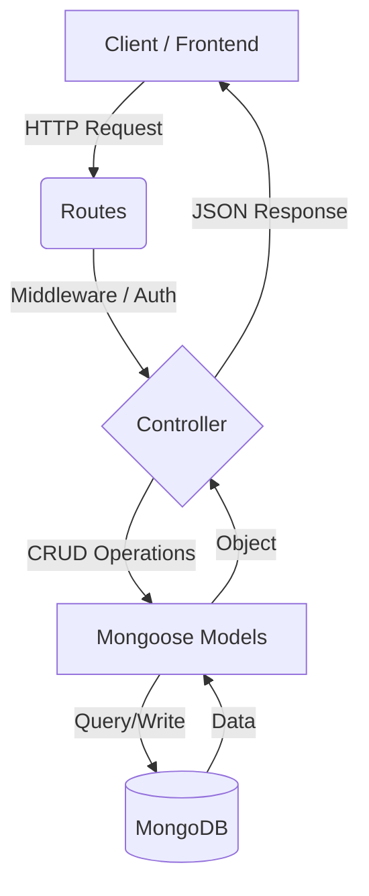
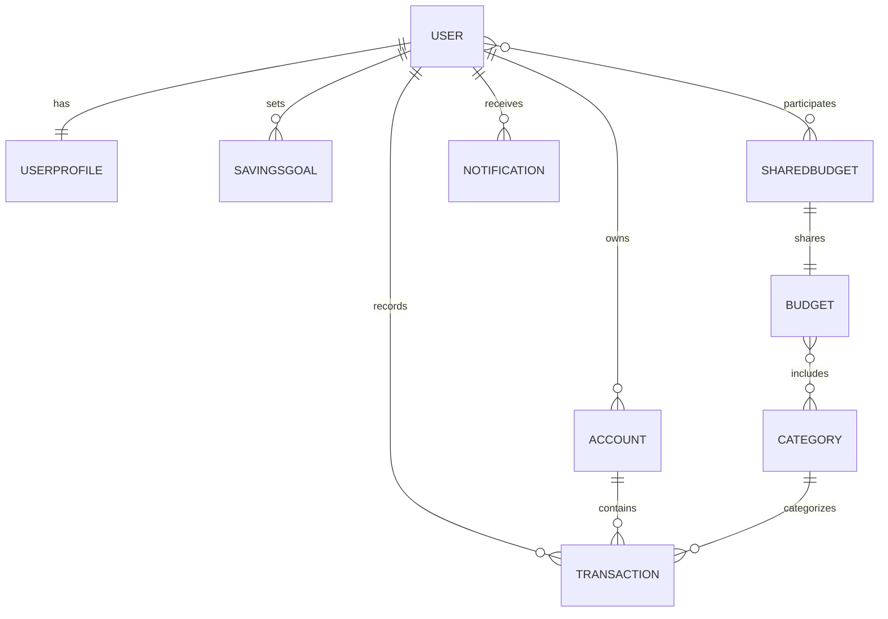

# 🚀 SmartWallet AI - Backend

SmartWallet AI is a high-end financial management platform powered by the MERN stack. It offers advanced tracking for personal and shared finances, savings goals, and AI-ready notification systems.

---

## 📑 Table of Contents
- [Features](#-features)
- [Technologies & Stack](#-technologies--stack)
- [Architecture](#-architecture)
- [Database Schema (Detailed)](#-database-schema-detailed)
- [Postman Testing Guide](file:///c:/Final%20Project%20MERN/smartwallet-ai/server/POSTMAN_GUIDE.md)
- [Step-by-Step Testing Flow](file:///c:/Final%20Project%20MERN/smartwallet-ai/server/POSTMAN_TEST_FLOW.md)
- [Download Postman Collection (JSON)](file:///c:/Final%20Project%20MERN/smartwallet-ai/server/SmartWallet_AI.postman_collection.json)
- [Installation & Setup](#-installation--setup)
- [API Documentation](#-api-documentation)
- [Project Structure](#-project-structure)

---

## ✨ Features

- **🔐 Secure Authentication**: Multi-layered security with JWT and password hashing (Bcrypt).
- **📊 Comprehensive Profiling**: Monthly revenue, risk levels, and localized currency settings.
- **🏦 Multi-Account Tracking**: Manage Checking, Savings, Investment, and Crypto accounts in one place.
- **💸 Smart Transactions**: Log expenses and income with metadata (recurring, important, refundable).
- **🎯 Savings Goals**: Milestone tracking for specific savings objectives like "Emergency Fund" or "Vacation".
- **🤝 Shared Budgets**: Real-time collaboration for households and groups.
- **🔔 Proactive Notifications**: Alerts for budget thresholds, anomalies, and goal achievements.
- **🤖 AI Financial Advisor**: Integrated Gemini AI to analyze spending and provide personalized financial advice.

---

## 🛠 Technologies & Stack

- **Runtime**: Node.js (v14+)
- **Framework**: Express.js
- **Database**: MongoDB (Atlas)
- **Object Modeling**: Mongoose
- **Auth**: JSON Web Tokens (JWT) & Bcrypt.js
- **Environment**: Dotenv
- **Dev Tools**: Nodemon, Postman (for testing)

---

## 🏛 Architecture

The application follows the **MVC (Model-View-Controller)** pattern for the backend, ensuring a clean separation of concerns.

### System Flow


### Key Components
1.  **Routes Layer**: Defines the API endpoints and maps them to specific controller functions.
2.  **Controller Layer**: Contains the business logic, processes incoming data, and interacts with models.
3.  **Model Layer**: Defines the structure of the data using Mongoose schemas and handles database interaction.
4.  **Middleware Layer**: Handles tasks like JWT verification, logging, and error handling before requests reach the controllers.

---

## 🗄 Database Schema & Relationships

### Visual Model


### 1. User
- **Relationships**: 1:1 with `UserProfile`, 1:N with `Transaction`, 1:N with `SavingsGoal`, N:N with `SharedBudget`.
- **Fields**: `username`, `email`, `password`, `profile_id`, `transaction_ids[]`.

### 2. UserProfile (Financial Profile)
- **Relationships**: 1:1 with `User`.
- **Fields**: `revenue`, `currency`, `alertThreshold`, `notificationPrefs`, `avatar`, `financialGoals`, `riskLevel`.

### 3. Account (Bank Account)
- **Relationships**: N:1 with `User`, 1:N with `Transaction`.
- **Types**: Checking, Savings, Investment, Crypto.
- **Fields**: `name`, `balance`, `institution`, `currency`.

### 4. Transaction
- **Relationships**: N:1 with `User`, N:1 with `Account`, N:1 with `Category`.
- **Fields**: `amount`, `date`, `type` (Income/Expense), `description`, `tags` (recurring, important).

### 5. Category
- **Relationships**: 1:N with `Transaction`, N:N with `Budget`.
- **Examples**: Food, Transport, Housing, Health.

### 6. Budget
- **Relationships**: N:1 with `User`, N:N with `Category`.
- **Fields**: `limit`, `month/year`, `alerts`.

---

## ⚙️ Installation & Setup

### 1. Prerequisites
- [Node.js](https://nodejs.org/) installed
- [MongoDB Atlas](https://www.mongodb.com/cloud/atlas) account (or local MongoDB)

### 2. Install Core Dependencies
```bash
# General dependencies
npm install express mongoose cors dotenv bcryptjs jsonwebtoken

# Development dependencies
npm install --save-dev nodemon
```

### 3. Setup Environment Variables
Create a `.env` file in the root of the `/server` directory:
```env
PORT=3000
MONGO_URI=mongodb+srv://<user>:<password>@cluster0.mongodb.net/smartwallet
JWT_SECRET=your_super_complex_secret_key
```

### 4. Run the Server
```bash
# Development (recommended)
npm run dev

# Production
npm start
```

---

## 📡 API Documentation

### Auth Endpoints
| Method | Endpoint | Description |
| :--- | :--- | :--- |
| `POST` | `/api/auth/register` | Create a new user account |
| `POST` | `/api/auth/login` | Authenticate and receive JWT |
| `GET` | `/api/auth/me` | Get current logged-in user data |

### Budget & Transaction Endpoints
| Method | Endpoint | Description |
| :--- | :--- | :--- |
| `GET` | `/api/transactions/:userId` | Get all transactions for a user |
| `POST` | `/api/transactions` | Create a new transaction |
| `GET` | `/api/budgets/:userId` | Fetch user's active budgets |
| `PUT` | `/api/savings-goals/:id` | Update savings goal progress |
| `POST` | `/api/ai/advice` | Get personalized AI financial advice |
| `POST` | `/api/ai/predict` | Predict future monthly expenses |

---

## 📂 Visual Project Structure

```text
smartwallet-ai/
└── server/
    ├── config/             # Database connection & dotEnv loader
    ├── controllers/        # Business logic controllers
    │   ├── authController.js
    │   ├── userController.js
    │   ├── transactionController.js
    │   └── ... (others)
    ├── middleware/         # Auth & Error handling middlewares
    ├── models/             # Mongoose Schemas (Data layer)
    │   ├── User.js
    │   ├── Transaction.js
    │   └── ... (9 total)
    ├── routes/             # API Router definitions
    ├── .env                # Local secrets & environment keys
    ├── package.json        # Dependencies & scripts
    ├── server.js           # Server entry point (Express app)
    └── README.md           # Documentation
```
